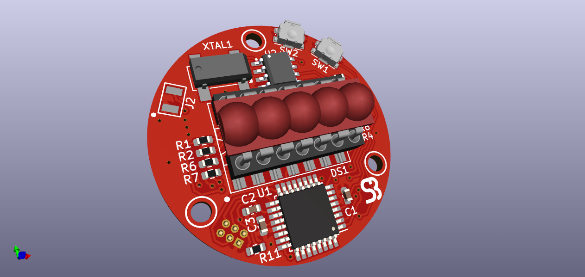
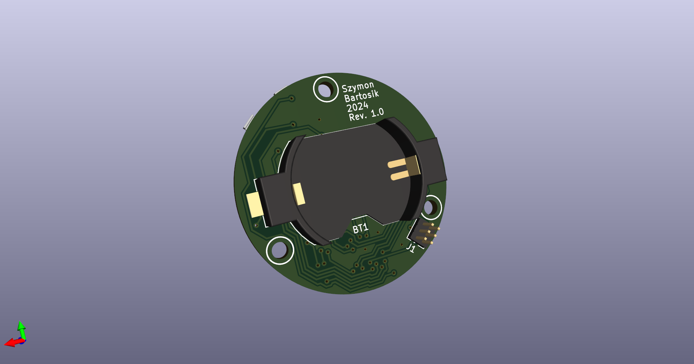

# Retro Bubble LED Watch
Retro Bubble LED Watch is a project dedicated to infamous HP's bubble LED seven segment displays produced around 1970s. The goal of this project is to create fully functional retro watch from scratch (including code) based around modern components while the aforementioned display being the centerpiece.

## Project's goal
Retro Bubble LED Watch is a project dedicated to infamus HP's bubble LED seven segment displays produced around 1970s. The goal of this project is to create fully functional retro watch from scratch (including code) based around modern components while the afordmentioned display being the centerpiece.
## Components

The circuit features ATMega328PB microcontroller fulfilling the role as the display multiplexer and I2C communicator with RTC module. For the RTC IC a popular DS1337 has been chosen due it's low standby power, wide supplay voltage range and low price point. Along with this IC comes an external precision quartz crystal designed for digital watches. Due to space limitations a standard 3V CR2032 lithium coin battery supplies power to the circuit. The capacity as well as the footprint of this power source is quite large and thus the rough estimated lifetime of single cell might be as long as 2,5 years while normal use.

## Features
- Time with precision to tens of seconds
- Date and numerical day of the week display
- 2 independent alarms
- Buzzer activated on alarm trigger
- SPI pins accesable for easy reprogramming
- 2 buttons for activating display/changing modes and time/date/alarm setting

