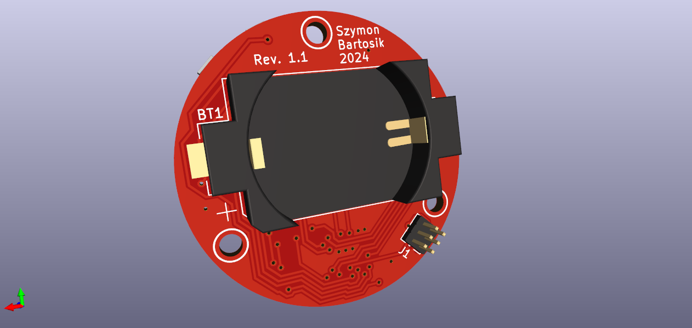

# Retro Bubble LED Watch
Retro Bubble LED Watch is a project dedicated to infamous HP's bubble LED seven segment displays produced around 1970s. The goal of this project is to create fully functional retro watch from scratch (including code) based around modern components while the aforementioned display being the centerpiece.

## Project's goal
Retro Bubble LED Watch is a project dedicated to infamus HP's bubble LED seven segment displays produced around 1970s. The goal of this project is to create fully functional retro watch from scratch (including code) based around modern components while the afordmentioned display being the centerpiece.

## Components
The circuit features ATMega328PB microcontroller fulfilling the role as the display multiplexer and I2C communicator with RTC module. For the RTC IC a popular DS1337 has been chosen due it's low standby power, wide supplay voltage range and low price point. Along with this IC comes an external precision quartz crystal designed for digital watches. Due to space limitations a standard 3V CR2032 lithium coin battery supplies power to the circuit. The capacity as well as the footprint of this power source is quite large and thus the rough estimated lifetime of single cell might be as long as 2,5 years while normal use.

## Features
- Display time with precision to tenths of seconds
- Date and numbered day of the week (1 - monday etc.) display
- Temperature measurement by uC's built-in sensor (requires individual calibration)
- 2 independent alarms
- Optional external buzzer activated on alarm trigger
- SPI pins accesable for easy reprogramming
- 2 buttons for activating display/changing modes and time/date/alarm setting

## Dependencies
The programme has been written in Arduino using only Wire library. To upload the code it is nessesary to install and add Mini-Core library to Arduino IDE. The fuse bits settings for ATmega328PB have to be left at factory default (including clock - internal 8MHz RC colock have been used) according to official Microchip datasheet.

## Temperature sensor calibration
Please refer to to ATmega328PB's datasheet section 28.8. "Temperature Measurement" or AVR122 application note. Every MCU requires individual calibration. In this project, a single point calibration method was used. The offset value can be tuned in source code by changing the value of "T_OFFSET" definition.

## External buzzer
Due to space limitations, an alarm buzzer couldn't be fitted on the PCB. Solder pads J2 provide a connection to the PE0 pin of MCU that turns on periodacly during the alarm. External piezoelectric disc can be connected to these pads and fitted onto the internal surface of the lid. The buzzer must not consume more than 40mA otherwise MCU can be damaged. 

## Case
The case is designed to be 3D printed using any material. Supports are nessesary.

## Battery life and current consumption
The CR2032 battery has the capacity to power the circuit for over 2 years but the accurate battery life is dependant on frequency of turing on the display which can consume up to 35mA in peak. This loads the battery and the voltage drop can couse the uC to shutdown when battery is drained. While in sleep the circuit consumes, according to manufacturers' datasheets maximum of arund 5uA in worst case scenario.

## Authors
Szymon Bartosik